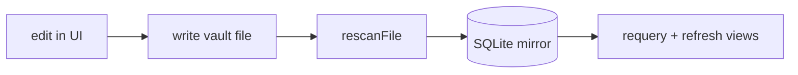

# Working in this repo (humans and AI agents)

Orientation for anyone — person or agent — picking this codebase up cold. The
standing order (docs/08): a competent TS developer becomes productive in a
day; every change is reviewed against that, not against taste.

## Read order

1. `README.md` — what Waffle is, current status, monorepo layout.
2. `docs/08-code-conventions.md` — the LAW: legibility SLO, dependency budget, quarantine rules.
3. `docs/03-adr.md` — the load-bearing decisions. Treat as settled; open an issue to reopen one.
4. `docs/02-architecture.md` — stack, storage classes, the Finder covenant.
5. Per-area specs as needed: `docs/12` (tables/notes-as-rows), `docs/10` (link details), `docs/09` (status/ratings), `docs/05`–`07` (connectors, schemas, catalog).
6. `docs/recipes/` — how to extend each seam. Update the recipe in the same PR that changes a seam.

## The invariants that must never break

- **Files are canonical** for private vaults. The SQLite index is a disposable
  mirror, rebuildable from the folder at any time.
- **One write loop.** Every mutation goes: write the vault file → targeted
  `rescanFile` → requery/refresh. Never write the `properties`/`toppings`
  tables directly — the scanner is the only thing that derives index state
  from bytes. (Cell edits, the note editor, paste flows, deletes, and the
  base write-back all already follow this; keep it that way.)



- **Deletes are soft** (ADR-021): files move to `.trash/` inside the vault.
  Nothing in the app hard-deletes user bytes.
- **Obsidian config syncs both ways** (ADR-020): `.base` view edits in Waffle
  write back via YAML document surgery. Owned keys only; when a state can't be
  expressed in Bases, FREEZE (write nothing) — never corrupt a user file.
- **Tokens only** — a raw hex/rgb in a component is a review-blocker
  (`packages/ui/src/tokens.css`).
- **Zero new dependencies by default** (docs/08). Additions need a one-line
  justification; prefer 30 lines of our own code over a 30 kB package.
- **SQL is the query language.** Readable queries in `queries.ts`, no ORM.
- **Quarantine modules** (hairy by necessity, fenced, invariants documented in
  their headers): vault scanner, `VirtualGrid`/`VirtualMasonry`,
  `PropertyTable`, CodeMirror `livePreview`, the Obsidian sync pair
  (`obsidianImport.ts` / `baseWriteback.ts`). No application logic inside them.

## Verification discipline

There is deliberately no test framework yet. Verification = `pnpm -r
typecheck` + `pnpm -C apps/web build` + a LIVE exercise of the affected
surface in the browser (dev server, real clicks, screenshots). State what you
verified in the PR/commit body. Commits: imperative subject, body explains
*why*, DCO sign-off (`git commit -s`) required.

## Dev setup and gotchas

```bash
pnpm install
pnpm dev        # app; append ?dev for the harness (seed 20k / clear seed / fixture vault / scan / bench)
```

- The fixture vault (`?dev` → Create fixture vault → Scan) includes
  `.obsidian/types.json` and a `Recetas.base` — the sync's test targets.
- **React StrictMode double-invokes dev effects.** Any effect that WRITES must
  be once-guarded (`useRef`) or idempotent under concurrency (the sync's
  reconcile runs in one exclusive transaction for this reason). A missed guard
  already caused a duplicated view once.
- **CodeMirror extensions are captured at construction** — HMR swaps the React
  component but not a running editor's handlers. Hard-reload after editing
  editor extensions before trusting behavior.
- **OPFS is per-origin**: changing the dev port = a fresh empty vault. Not a
  bug; reseed via the harness.
- The seeder wipes ALL tables (deterministic benchmarks); `Clear seed data` is
  its surgical inverse and touches no vault rows.

## Position (2026-07-23) and how to proceed

**P0 (spine) complete and verified.** P1 shipped so far: typed properties +
declarations (`.waffle/properties.json`), the table layout (create-row-in-table,
bulk edit, spreadsheet paste with column/kind inference), saved-view manager
(named views per folder, defaults, SQL-compiled filters, property sort,
group-by in table/grid/list), paste/drop images into notes + first-image note
thumbnails, soft delete, and bidirectional Obsidian config sync.

The table now also has Airtable-grade cell/range selection, keyboard navigation
and commit movement, type-to-replace, canonical TSV copy, paste-at-anchor with
overflow note creation, and notes-only range clearing. Its
selection/editing/virtualization state machine is quarantined in
`packages/ui/src/tableGridState.ts`; its executable acceptance contract is
`docs/recipes/verify-table-interactions.md`.

**Slice A hardening complete:** invalid non-empty typed/pasted values are
rejected without aliasing clear; same-note read-modify-write commits serialize
per vault path; pending mutation state cannot report idle or reconcile over a
newer optimistic patch; and the grid exposes stable active-descendant,
row/column/value/edit, and full-range selection semantics. The executable
acceptance contract records the adversarial cases that exposed these defects.

**Next, in agreed order:**

1. **Table interaction slice B** — column resize + drag-reorder (persist
   widths in view config, evolving `columns: string[]` →
   `{key, width}[]` with silent migration), sticky Title column, fill-down.
2. **Slice C** — session undo/redo (inverse patches over property writes;
   deletes un-trash by stored path).
3. **P1 remainder**: status/ratings surfacing in library views (chips +
   interaction filters), theme palette editor, Supabase auth, Capacitor shell
   (share extension), Tauri shell (native FS watching — replaces the
   per-write-site rescans with a real watcher), on-device Whisper.

Known deferred gaps (each states its owner): list property kind (Obsidian
`multitext` skips until it exists), filter NOT/negation (skipped on import),
link/file properties (`.waffle/meta.json`, ADR-013), restore-from-trash UI,
vault switcher (single active vault is documented v1 behavior), manual
acceptance specs for the remaining quarantine modules (the table contract now
lives at `docs/recipes/verify-table-interactions.md`; write the others as
recipes/headers when next touching each module), and simplification of the
three large orchestrators (Library / TableLayout / PropertyTable) once their
responsibilities stop fitting a short explanation — audit corrective #6,
deliberately last.

**Escalation rule:** this file and the docs carry the engineering contract and
the agreed queue — nothing more. Product direction, prioritization changes,
and anything touching money, accounts, publishing, or third-party services are
the repo owner's decisions: when a task needs one, STOP and ask; don't
improvise. GitHub side: work in this repo only — never push to `waffle-shell`
(the deploy workflow owns it), never touch Actions secrets or repo settings.
