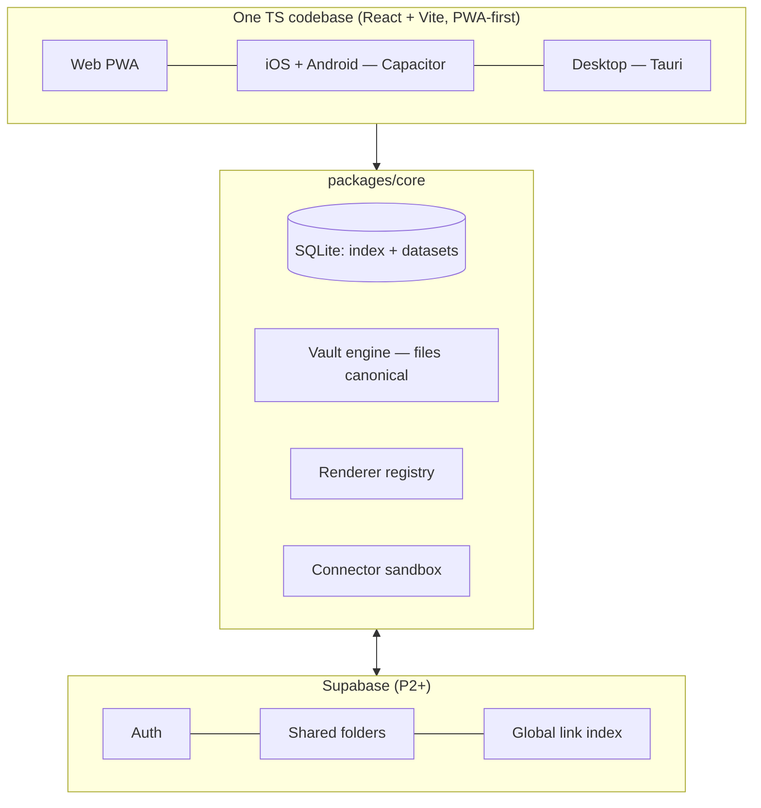

# Architecture

One TypeScript codebase. SQLite everywhere. Platform shells are thin adapters.



## Stack

| Layer | Choice | Rationale |
| --- | --- | --- |
| App | React + TypeScript + Vite, PWA-first | DOM-heavy product (CodeMirror, masonry, pdf.js, iframes); RN/Flutter would wrap webviews anyway |
| Mobile | Capacitor | Same bundle + native plugins: camera, mic, native SQLite, **share extension** ("Save to Waffle") |
| Desktop | Tauri 2 wrapper | Native-grade FS watching for the Finder covenant; PWA alone lacks it on Safari |
| Data | SQLite behind one adapter — wa-sqlite/OPFS (web), native drivers (Capacitor/Tauri) | One schema and query language on every platform; FTS5 for search |
| Server | Supabase — auth, shared folders (Postgres + RLS), storage, edge functions | Grants enforced in the database, not app code; deferred to P2+ |

## Two storage classes, one UI

| | Private folders | Shared folders |
| --- | --- | --- |
| Canonical home | Files on device (`.md` + frontmatter) | Server (Supabase) |
| Offline | Always fully local | Local SQLite cache, sync on reconnect |
| Conflicts | n/a (single writer) | Last-write-wins per topping + tombstones; note co-editing later |
| The DB's role | Disposable, rebuildable index | Authoritative replica cache |

Sharing a private folder promotes its subtree to server-homed (one-way ceremony). The UI never shows the seam.

## The Finder covenant (desktop)

The vault is a normal folder:

```
~/Waffle/
├── Finances/
│   ├── tax-2026.md              # note; frontmatter = properties (canonical)
│   ├── escritura.pdf            # file topping = the file itself
│   ├── Net Worth.dash           # dashboard (JSON, text-diffable)
│   └── Broker comparison.url    # link topping (OS-native link format)
└── .waffle/
    ├── index.sqlite             # rebuildable index — never precious
    ├── meta.json                # properties/tags for links & files
    └── thumbs/                  # 2-size webp + blurhash cache
```

Drag in/out via Finder; the watcher follows; files moved while the app was closed re-associate by content hash. An Obsidian vault dropped in works immediately (`.md`, frontmatter → properties, tags, wikilinks, mermaid); `.base` files convert to saved views via the P1 importer; Obsidian and Waffle can point at the same folder simultaneously during transition.

## Sharing model (Drive semantics)

`grants (folder_id, grantee: user | invite-link, role: viewer | editor)`. Effective access = **nearest ancestor grant**; no deny rules; inheritance covers the subtree. Views in shared folders come in two kinds: shared (folder canon) and personal (per-member). `owner_id` + grants exist in the schema from day 0, dormant until identity ships — retrofitting ACLs is migration hell.

## View engine

A view = `{layout, filters AST, sorts, group_by, visible properties, subtree?}` scoped to a folder (or to a query = smart folder). Layouts and widgets resolve through a **renderer registry**: every renderer is `(query results → props) → component`. Manual ordering uses fractional index keys (one write per drop, no renumbering). Natural-language view creation compiles user intent to the filter AST via LLM structured output.

## Theming

User-configurable palettes, architected at the token layer so it can never require a retrofit:

- **Semantic tokens only.** ~20 CSS custom properties (`--bg`, `--surface`, `--border`, `--text`, `--text-dim`, `--accent`, states…). Components reference tokens exclusively — a raw hex in a component is a review-blocker (see 08-code-conventions.md).
- **Themes are token-value sets.** Built-ins (light, dark, system-follow) ship at P0 step 4; the **palette editor** ships P1: users pick a few *seeds* (accent, neutral base, light/dark), the engine derives the full ladder — surface elevations, border strengths, text tiers, state colors — in **OKLCH** (perceptually uniform, so derived scales stay legible). A WCAG contrast check warns on unreadable combinations before applying.
- **Renderers consume tokens too**: charts, dashboard widgets, mermaid, and map styles re-color with the theme — one system, no per-widget theming.
- **Storage**: theme choice + custom palettes in the local `settings` KV (synced with the account later). A theme serializes to a small JSON doc — shareable, and eventually distributable through the same package/store machinery as connectors and renderer packs.

### Waffle default theme (brand, set 2026-07-22)

- **Categorical pastel ramp** — six brand colors, exposed as `--ramp-1..6` with names:
  `lavender #BFB0EA` · `aqua #9FDAE0` · `peach #F9D3B6` · `periwinkle #C0CEEF` · `mint #A2DD93` · `blush #FDB8B9`.
  Usage rule (contrast-driven): ramp colors are **fills carrying dark ink** — chips, card tints, folder colors, tag colors, chart series, status-set accents — never text colors. Default accent seed: `lavender`. Dark mode re-derives the ramp at adapted L/C in OKLCH, same hues.
  Default assignments (user-remappable): folders → lavender · notes → peach · links → aqua · files → periwinkle · dashboards → mint · alerts/hearts → blush.
- **Type**: **Nunito** (headers) + **Raleway** (body ≥ 400 weight at small sizes), self-hosted via `@fontsource-variable/*` — no font CDNs (privacy + PWA offline). Responsive sizing per the workspace rule: `rem`/`clamp()`, never `px`.
- **Icons**: **Iconsax** (Vuesax family) — `linear` as default style, `bold` for active/selected states; React port at implementation time (bundle SVGs directly if the port stalls — dependency-budget rule applies).

## Performance strategy (the "blistering at 20k" contract)

- SQLite with proper indexes: folder view queries ~1–5 ms at 20k toppings; FTS5 search ~5–15 ms.
- The DOM is the real risk: virtualized masonry — ~30 mounted cards regardless of collection size.
- Images: precomputed 2-size webp + blurhash; originals never decode in the grid.
- Cold start: the DB *is* the index; files parse incrementally via watcher — no full-vault re-read on launch.
- Property filters: indexed EAV (+ expression indexes materialized in the background for hot keys).
- Web caveat: OPFS SQLite ~5× slower than native — still ms-class at this scale; mobile/desktop run native drivers.

## Datasets & dashboards

Datasets are plain SQLite tables filled by connectors (see `05-connector-sdk.md`), namespaced, never shown in the folder tree. A dashboard is a topping whose `.dash` JSON lists `{renderer, query}` widgets over datasets and the library itself. Snapshot-style connectors (e.g., finance) append daily rows; history is what makes trend charts. AI view builder: schema-aware LLM generates query + view spec; connectors bundle suggested dashboards (install → authorize → working dashboard in three taps).
