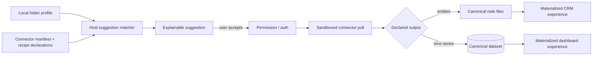

# Connector-Driven Experiences

Reference contract for turning external systems into useful Waffle experiences
without exposing the library to connector code. The two canonical examples are:

- Apple/Google Contacts → linked contact notes → a lightweight CRM.
- Oura → canonical health datasets → a Sleep Dashboard in Wellness.

This extends ADR-008 and ADR-018. It is a pre-implementation specification;
the manifest shape remains conceptual until the connector SDK ships.

## Two output modes, one onboarding grammar

| Source shape | Connector output | Library result |
| --- | --- | --- |
| Durable entities a person annotates: contacts, bookmarks | **Topping materialization** | One canonical file/note per entity; source-owned fields merge with user-owned content |
| High-frequency/time-series facts: sleep, balances, sensors | **Dataset writes** | Canonical pantry tables; a bundled recipe creates dashboard toppings/views |

Both packages may declare experience recipes. The host matches those declarations
to local folder context; sandboxed connector code never receives the folder
name, library rows, notes, or other datasets.



## Manifest-to-suggestion boundary

A package may declaratively advertise:

- The canonical schemas or source entity types it supplies.
- Bundled experience/dashboard recipes.
- Coarse intent hints such as wellness, sleep, contacts, or CRM.
- The permissions, hosts, schedule, and output tables/fields already required
  by the trust manifest.
- Whether the recipe can be offered before connection and what remains useful
  if the source is disconnected.

The host combines this public metadata with an on-device folder profile.
Matching is explainable: “Suggested because this folder is named Wellness and
Oura supplies sleep data.” No arbitrary connector code runs during ranking.

Acceptance materializes a versioned snapshot. Package updates may offer an
upgrade, but never overwrite a dashboard/view the user customized.

## Reference flow A: Contacts → CRM

### Canonical representation and identity

Each contact becomes a markdown note. Reserved source metadata records the
connector ID, account/source namespace, and source entity ID; exact key names
must be frozen with the materialization API. Durable Waffle topping identity
remains separate under `.waffle/` (ADR-022).

The source identity is connector-specific:

- Google People persists the account-scoped source ID plus resource-name
  history/change tokens; a People resource name itself can change when Google
  links or unlinks profile data.
- Apple Contacts identifiers are device-local. Store them only as a local
  adapter binding, never as portable person identity. A second device must
  reconcile against the existing Waffle contact and ask before any uncertain
  re-link.
- Normalized email/phone values are fallback evidence, never sufficient for an
  ambiguous automatic merge.

Multiple sources that appear to describe one person remain separate until the
user confirms linking. A later Person entity layer can retain several source
identities without destroying provenance.

### Platform availability and freshness

Apple Contacts requires a native Capacitor/Tauri adapter and explicit system
contact permission; the browser PWA cannot read the Apple address book. Google
People uses OAuth and works wherever that callback can complete. vCard remains
the portable one-shot fallback.

“Linked” means source fields reconcile on the next successful connector run,
not that Waffle promises an always-running phone daemon. Native background
refresh is best-effort; foreground/app-open and explicit **Refresh** must always
work. The provenance UI shows last successful refresh and permission/account
failures.

### Field ownership

| Class | Examples | Rule |
| --- | --- | --- |
| **Source-owned** | Display name, phone, email, postal address, organization, source avatar | Refreshed from Contacts; visibly linked/read-only in Waffle v1 |
| **User-owned** | Markdown body, Waffle tags, status/rating, custom properties, relations | Connector never edits |
| **Derived** | Last contacted, meeting count, follow-up state, backlink timeline | Recomputed locally; never written back to Contacts |

A source's own notes field, if imported, is a namespaced source-owned property;
it never replaces the Waffle markdown body.

To change a source-owned phone number, v1 offers **Edit in Contacts**. Two-way
write-back is a later field-by-field capability with a new permission and
conflict contract; it is never inferred from ordinary cell editing.

### Reconciliation loop

For every created/changed contact:

1. Resolve the note by stable source identity, not filename.
2. Read the current canonical note.
3. Replace only connector-owned fields; preserve user-owned frontmatter/body.
4. Write the vault file.
5. `rescanFile`.
6. Requery once the bounded batch settles.

The connector receives no `VaultFs` or database handle. The host executes this
loop from validated materialization commands. Multiple devices/runs remain
idempotent by `(connector, account, source entity, source revision)`; only one
device/job should actively pull a given source at once once managed Sync exists.

### Delete and detach semantics

- Deleted at source → set `source_status: removed`; never trash the note or its
  annotations.
- User chooses **Keep as Waffle contact** → detach source ownership and retain
  an ordinary note.
- User trashes a linked note → record a suppression tombstone for that source
  entity so the next pull cannot resurrect it. Restoring clears suppression.
- Disconnect/uninstall → retain files/data and show stale/disconnected
  provenance until the user explicitly detaches or removes them.

### CRM experience

The package can offer **Set up Contacts CRM**, which materializes:

- People table/gallery with source fields.
- Follow-up/status views (`queued` reach out, `active` in conversation,
  `done` met) using the existing status-set model.
- Companies and relationship views when relation properties ship.
- Recent/contact-needed views from interaction dates.
- A contact detail template whose markdown body is the user's private dossier.
- Backlinks from meeting notes as an interaction timeline.

Contacts are categorically local/private: never catalog contributions,
community signals, or remote recommendation context. If managed Sync is
enabled, notes and connector state use the same E2EE envelope as the vault.

## Reference flow B: Oura → Sleep Dashboard

### Suggestion and authorization

Inside a folder such as Wellness, the host can match its local intent profile
against Oura's manifest/recipe declaration:

```text
Sleep Dashboard
Sleep · readiness · HRV trends
Connects to api.ouraring.com; cannot read your library
                         Connect Oura
```

If Oura is already connected, the action becomes **Add Sleep Dashboard**. If
several providers can supply `health.sleep`, Waffle offers the appropriate
connections and preserves user-controlled source priority rather than
double-counting.

### Data and experience flow

1. Explicit OAuth authorization. Tokens stay in the device keychain where the
   provider flow permits it; never embed a provider client secret in the app.
   A required OAuth broker is restricted to code/token exchange and receives no
   health payload.
2. The sandbox pulls Oura records and calls `ctx.write` only for manifest-
   declared canonical/extension tables.
3. The host validates, converts units, stamps source + stable provider record
   identity, and performs idempotent upserts.
4. Canonical data lands in `health.sleep`, heart-rate/HRV, and other approved
   schemas; Oura-only facts remain namespaced extensions.
5. The accepted recipe creates a `.dash` topping in Wellness whose widgets
   query canonical schemas, not Oura-specific tables where a standard exists.

The dashboard may contain sleep duration/regularity, readiness, resting heart
rate/HRV, trends, and source health. Exact medical interpretation is out of
scope; Waffle displays personal data and provenance, not diagnosis.

If Oura disconnects, the dashboard and already imported local data remain.
The UI reports the stale date and offers reconnect; it does not silently erase
history. Managed Sync encrypts datasets and dashboard files. A nominated
puller/lease plus provider record IDs prevents two devices duplicating rows.

Oura recommends webhooks for freshest data, but a webhook broker observes
health-event metadata and a server-side pull would expose plaintext health
records. The privacy-preserving first implementation therefore pulls on-device
on app-open/manual refresh (plus best-effort native background work) and states
that freshness limit. Any later webhook mode requires separate consent,
documented metadata exposure, and security review.

## Privacy and catalog separation

- Connector data and folder context never become catalog input.
- The host may use installed/available manifest metadata for local suggestions.
- Health and contacts are excluded categorically from discovery contributions.
- A dashboard's existence or title is not sent to the connector.
- Cloud OAuth brokering, when required, exchanges tokens only; it does not
  receive connector payloads.

## Pre-implementation acceptance cases

### Contacts

1. Change a phone number on the phone; sync updates only that source-owned
   field and preserves body/tags/status/custom fields byte-for-byte.
2. Delete a contact at source; the annotated note remains and says removed.
3. Trash a linked note; two subsequent pulls do not recreate it; restore
   re-enables reconciliation.
4. Present matching Apple + Google contacts; no automatic destructive merge.
5. Rename the note and rebuild SQLite; source and topping identities survive.
6. Run two identical pulls; no duplicate files or property rows.

### Oura

1. Wellness + disconnected Oura produces an explainable connection suggestion;
   the connector still cannot inspect the folder.
2. Accept/authenticate; canonical rows and one dashboard materialize without
   direct index writes.
3. Connect a second sleep provider; source priority prevents double-counted
   totals and provenance remains visible.
4. Customize the dashboard; a package update does not overwrite it.
5. Disconnect Oura; history/dashboard remain with explicit staleness.
6. Sync to a second device; encrypted datasets decrypt locally and do not
   duplicate on the next pull.

## Vendor facts that constrain implementation

- [Apple Contacts identifiers](https://developer.apple.com/documentation/contacts/cncontact/identifier)
  identify a contact only on the current device; the framework may also expose
  a unified contact assembled from linked records.
- [Google People](https://developers.google.com/people/api/rest/v1/people)
  exposes source IDs, sync deletions, prior resource names, and update
  metadata; resource names can change when linked profile fields change.
- [Oura API v2](https://cloud.ouraring.com/v2/docs) exposes OAuth-scoped sleep,
  readiness, heart-rate/HRV, and related records with provider document IDs.
  [Oura OAuth](https://cloud.ouraring.com/docs/authentication) supports
  per-scope authorization and revocation.
