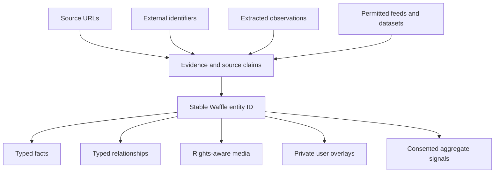

# Catalog Product & Entity Graph

The contract between Waffle Core and the separate Waffle Catalog product.
Waffle Core is a complete local-first library without the Catalog. The Catalog
is an optional proprietary discovery product whose master corpus, entity
resolution, ranking, aggregation, and abuse systems live behind ADR-019's
private server boundary.

This separation is structural, not merely a repository choice. The products
have different consent, rights, moderation, availability, and economic
constraints. Core must remain useful when the Catalog is disabled, unreachable,
unavailable in a jurisdiction, or discontinued.

## Product boundary

| Surface | Canonical state | Distribution | Dependency |
| --- | --- | --- | --- |
| **Waffle Core** | User vault files; private overlays and local evidence | Open-source client | None on Catalog |
| **Catalog protocol** | Versioned request/contribution schemas | Open and auditable | Optional Core integration |
| **Schema vocabulary** | Types, predicates, identifier schemes, units | Open | Shared vocabulary, not shared data |
| **Waffle Catalog** | Master entity/claim graph and aggregate signals | Proprietary service and corpus | May consume permitted/consented evidence |
| **Discovery surfaces** | Derived search/feed results and permitted previews | Catalog product UI/API | Never canonical for a private vault |

Public access to discovery results does not make the underlying corpus open
data. Bulk export, redistribution rights, commercial feeds, and partner access
are explicit Catalog product decisions.

## One graph, many evidence sources



A Waffle entity ID is opaque, stable, and provider-neutral. It is never
derived from a URL, ISBN, GTIN, DOI, IMDb ID, MusicBrainz ID, Place ID,
merchant SKU, creator ID, name, coordinates, or content hash. Those values are
identifier claims: evidence about an entity, not ownership of its identity.

The Catalog is therefore not a Google Maps clone and not a union of
provider-specific catalogs. Provider adapters collect evidence. They do not
define entity IDs, graph topology, or truth.

## Five layers that must not collapse

| Layer | Meaning | Persistence |
| --- | --- | --- |
| **Local URL alias projection** | ADR-026's deterministic raw URL → normalized/provider candidate bridge | Disposable SQLite; rebuildable |
| **Durable private entity identity** | An opaque local entity ID used by private marks/evidence when the generic substrate ships | Portable `.waffle/` metadata; E2EE when synced |
| **Public Catalog entity** | The Catalog product's canonical provider-neutral entity and redirect history | Proprietary Catalog graph |
| **Private user overlay** | Status, rating, note, dates, local ranking evidence | Private owner scope only |
| **Source claim / external identifier** | A sourced assertion about identity, type, fact, relationship, or media | Claim record with provenance and rights |

The current migration-v6 `entity_key` is the first layer. Despite its name, it
is a deterministic effective candidate for local interaction projection, not a
durable Waffle entity ID and not a Catalog entity ID.

### Private and public IDs

Core may mint durable opaque private entity IDs so interactions and explicit
local **Same thing** decisions survive reconstruction without a network.
Catalog canonical IDs are issued and resolved inside the Catalog product. A
private record may store a mapping to a Catalog entity, but:

- the private ID remains recoverable history rather than being rewritten out
  of existence;
- a contribution does not use the private ID as a public contributor or
  correlation identifier;
- mapping does not upload private claims, folder context, or overlays;
- a Catalog correction cannot silently rewrite a user's private vault.

The exact ID encoding, `.waffle/` layout, redirect projection, and migration of
current interaction keys require an implementation ADR before scanner changes.

## Claim model

The conceptual records are deliberately generic:

```text
entity
  entity_id · type claims · lifecycle state

identifier claim
  scheme · value · issuer/provider · subject entity
  source · confidence · observed_at · valid_from/to · state

fact or relationship claim
  subject entity · predicate · literal or object entity
  source · confidence · observed_at · valid_from/to · state

media claim
  subject entity · source URL/asset · creator/rightsholder
  licence/permission · attribution · observed_at · hash · takedown state

identity event
  merge · redirect · split · identifier succession · dispute
  affected entities/claims · evidence · actor · time
```

Types and relationships are themselves sourced claims. Conflicting claims may
coexist; resolution selects an effective projection without erasing the
observations that produced it. Confidence is evidence strength, not a
substitute for provenance.

### Identity history

- **Merge:** choose an effective entity, redirect the others, retain every ID
  and claim.
- **Split:** create or select resulting entities and reassign claims with an
  auditable event; never reuse a retired ID for a new meaning.
- **Identifier succession:** link predecessor and successor claims with
  validity intervals; never re-key the Waffle entity to the provider value.
- **Same thing:** record explicit evidence and run the same conflict-preserving
  merge path. Raw user files do not change.
- **Dispute:** preserve competing claims and reduce or suppress their effective
  projection; history remains inspectable.

## Privacy boundary

Private exact evidence is not the public graph.

- Vault paths, folder names, folder membership, co-save context, notes, exact
  location, and private entity IDs stay local or inside the encrypted personal
  replica.
- Statuses and ratings are private overlays. Shared-folder members do not see
  one another's overlays.
- A distinct, explicit Catalog contribution ceremony produces the permitted
  public projection. Signing in, saving, syncing, sharing, and publishing are
  not consent to contribute.
- Consented aggregate inputs may cover distinct saves, ratings, popularity,
  save velocity, and approved coarse market/time buckets.
- Contributions contain no exact user location, folder/co-save context, IP
  history, or stable public user identifier.
- Exact location may rank Catalog results locally without leaving the device.
- Sparse aggregates roll up or remain hidden under the Catalog product's
  reviewed privacy thresholds.

Sensitive entity classes—including people, homes, minors, health, sexuality,
religion, politics, safety-critical locations, and abuse targets—require an
explicit Catalog allow/deny/review policy before ingestion or discovery. The
generic graph's ability to represent a claim is not permission to publish it.

## Acquisition and distribution boundary

Catalog growth is permission-aware:

| Input | Boundary |
| --- | --- |
| User-initiated save or refresh | Parse the material the user selected; private copy stays private; public projection requires consent and permitted reuse |
| Page metadata | Use only material available and permitted for the requested action; retain provenance |
| Authorized API | Obey scopes, quotas, attribution, caching, display, retention, and deletion terms |
| Creator/merchant feed | Use the explicit feed agreement and item/media rights |
| Licensed/open dataset | Preserve source-level and claim/media-level licence obligations; isolate incompatible regimes |
| Public standard | Use identifiers and vocabularies as standards, not as a licence to copy a provider database |
| Partnership | Contract defines acquisition, correction, distribution, and termination rights |

Waffle does not depend on unauthorized bulk crawling, authentication or quota
circumvention, imitation of private APIs, or indiscriminate republication of
third-party content. A URL or identifier may be stored as evidence without
granting rights to copy the source's text, media, ratings, or database.

Every public claim/media ingestion path carries a rights basis, permitted-use
class, attribution requirements, retention/expiry rule, and takedown route.
Data with incompatible obligations remains source-isolated unless the Catalog
product explicitly establishes a compliant combined projection.

## Current implementation boundary

ADR-026 and migration v6 remain correct and deliberately narrow:

- raw `.url` files are immutable user content;
- normalizer v1 is versioned and offline;
- only the documented single-`query_place_id` Google Maps Search shape is
  recognized on exact allowlisted hosts;
- no redirect, API request, crawler, telemetry, or catalog contribution occurs;
- conflict-preserving `url_entity_aliases` and `topping_entities` remain
  disposable projections.

Do not expand the Google adapter or treat its hashed candidate as durable
identity. Durable manual/network evidence, short-link resolution, provider-ID
succession, and **Same thing** must use the future generic entity/claim
substrate rather than another URL-specific sidecar.

## Sequence

1. Keep deterministic URL sub-slice A unchanged.
2. Ship the P1 usability shell and ADR-022 durable vault/folder/topping
   identity; neither depends on the Catalog.
3. Settle the portable private entity/claim representation, ID mapping, mark
   migration, redirects, splits, and acceptance recipe in an implementation
   ADR.
4. Implement the smallest offline generic substrate with no network path.
5. Resume URL sub-slice B on that substrate.
6. Develop the Catalog as a separate product, beginning with a legally and
   economically validated source/vertical rather than an indiscriminate
   everything crawl.

The graph may aspire to identify every thing. Acquisition remains
permission-aware, provenance-rich, privacy-preserving, and economically
realistic.
