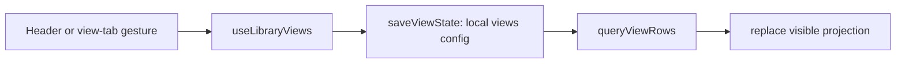
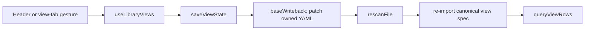

# Recipe: trace library coordination

The Library screen separates vault lifecycle from saved-view persistence. Keep
that distinction explicit: a full scan reconciles canonical files, while a
view edit usually changes only local presentation config.

| Responsibility | Owner |
| --- | --- |
| Screen composition, dialogs, folder picker, add/drop flows | `apps/web/src/library/Library.tsx` |
| Folder/view selection, view CRUD, row projection, quiet refresh | `apps/web/src/library/useLibraryViews.ts` |
| Full scan → Obsidian sync → thumbnail pass | `apps/web/src/library/vaultLifecycle.ts` |
| Readable SQL and local view-config persistence | `apps/web/src/library/queries.ts` |
| Derived-view canonical `.base` writes | `apps/web/src/importer/baseWriteback.ts` |

## Persistence traces

Ordinary Waffle view edit:

Obsidian-derived view edit:

Full vault reconciliation:

## Constraints

1. `Library.tsx` does not write view config or query view rows directly.
2. `useLibraryViews.ts` does not scan vaults, generate thumbnails, or own
   editor/dialog state.
3. View refs update synchronously with optimistic state so two rapid patches
   compose before React renders; persistence serializes so their `.base`
   writes cannot overtake one another.
4. `refreshQuiet` replaces rows in place after mutations; it must not introduce
   the loading-null flash that destroys table scroll/editor continuity.
5. A derived view write freezes in `baseWriteback` when Bases cannot express
   it. The controller may report the view as Waffle-owned, but must not coerce
   the canonical `.base`.

## Manual acceptance

1. Create and scan the fixture vault. Switch folders and views; defaults,
   counts, grouping, filters, and layouts must load without duplicate queries
   becoming visible as flashes.
2. Rapidly change a table layout and sort. Both changes must persist after
   reload; neither may overwrite the other from a stale closure.
3. Create, rename, default, and delete an ordinary view. Reload and confirm
   local view config survives without changing a vault file.
4. Resize or regroup an Obsidian-derived view. Reload and rescan; confirm the
   owned `.base` fields round-trip or the operation freezes without byte loss.
5. Edit a table cell and close a note editor. Confirm `refreshQuiet` updates
   filters/groups while preserving the table surface rather than flashing an
   empty/loading state.
6. Create a topping through Add and through drag/drop. Confirm the full vault
   lifecycle runs and the new item, Obsidian report, and thumbnail state agree.
