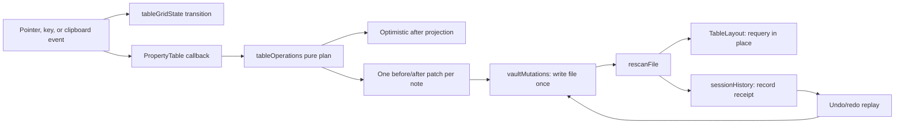

# Manual acceptance: table interactions

This is the executable specification for Waffle's table interaction quarantine:

- `packages/ui/src/tableGridState.ts` owns pure selection/editing transitions.
- `packages/ui/src/tableClipboard.ts` owns canonical TSV spelling/parsing.
- `packages/ui/src/useTableColumnInteractions.ts` owns resize/drag pointer
  sessions and emits one complete column-config patch.
- `packages/ui/src/PropertyTable.tsx` owns grid DOM events, focus, and row
  virtualization.
- `apps/web/src/library/tableOperations.ts` purely plans row-batched patches
  and note creation; every patch carries `before` and `after`.
- `apps/web/src/library/vaultMutations.ts` executes file writes, rescans, and
  soft deletes, then replays stored receipts for undo/redo.
- `apps/web/src/library/sessionHistory.tsx` owns the volatile undo/redo stacks,
  replay exclusion, keyboard routing, and history error surface.
- `apps/web/src/library/TableLayout.tsx` owns optimistic projection,
  pending-operation accounting, canonical requery, and table controls.

Run the relevant sections after any change to those files, table view config,
property parsing, grouping, or vault rescanning. Slice A/B/C work is not
complete until this specification passes, along with typecheck and build.

## Non-negotiable invariants

1. A cell is identified by stable `(item id, column key)`, never by a mounted
   DOM node or transient row index.
2. Selection is one anchor/focus pair. Its range is the rectangle between
   those cells in the current visible row/column projection.
3. Virtualization may unmount selected rows. The actively edited row stays
   mounted so an uncommitted native-input draft survives scrolling.
4. Only vault-backed notes are editable. Link, file, and dashboard rows remain
   visible but read-only until ADR-013 metadata write-back exists.
5. Every mutation is file-first. Compose one patch per note, write that note
   once, run `rescanFile`, then requery. Never patch index tables directly.
6. Empty input means “clear.” Invalid non-empty input must never be interpreted
   as “clear” or destroy the previous value.
7. Multiple rapid commits to the same note must serialize without losing an
   earlier property patch.
8. Busy state covers writes, rescans, and requeries. Intermediate refreshes
   must not replace newer optimistic patches; the last outstanding mutation
   reconciles the visible property map with the SQLite mirror.
9. History records only completed canonical file changes. A targeted rescan
   failure is a visible projection warning, not permission to forget the file
   change; undo/redo must still remain truthful. React never applies inverse
   patches.
10. A forward command in flight blocks replay. Concurrent commands enter the
    undo stack in gesture-start order, regardless of I/O completion order.
11. A successful new recorded command clears redo. Reload or active-vault
    replacement clears both stacks; history is never persisted.
12. Soft-delete replay uses the receipt's exact original/trash path pair. If
    the destination is occupied, replay refuses to overwrite it and leaves the
    entry at the stack head.
13. Cmd/Ctrl+Z belongs to Waffle only outside native text controls and
    CodeMirror. Inputs and the note editor retain their own document undo.
14. Slice C reverses property patches and soft deletes. Overflow/ghost-row
    note creation is not reversible; a mixed paste undoes its existing-row
    property patches but does not trash the notes it created.
15. Undo/redo validates the current canonical value of every targeted property
    before its first write, then validates again inside the per-path write
    queue. A changed target freezes safely; unrelated body/property edits do
    not block replay and must be preserved.
16. If a multi-file command fails after a prefix completed, that prefix enters
    history as a partial receipt. If replay itself fails after a prefix, the
    applied and remaining halves occupy opposite stack heads. Retrying must
    never apply one file twice.
17. Full-note saves, note/link/file creation, asset creation, and property-type
    changes invalidate older history before writing because they do not yet
    have complete inverse receipts. A mixed paste starts a new epoch, then
    records only its reversible existing-row patches.
18. History retains at most 100 entries and 8 MB of serialized receipts. An
    individually oversized gesture completes but is omitted with a visible
    warning; older usable entries remain.
19. Deleting an open note awaits any in-flight save and flushes its current
    draft before moving the file. If save or delete fails, the editor stays
    open with the draft recoverable (dirty if it was not flushed); a delayed
    save must never resurrect the moved path.



The cycle is deliberate: forward and inverse commands share one canonical
file-first path. The history layer orders receipts; it does not become a
second mutation engine.

## Cell capabilities

| Cell | Select and navigate | Edit | Clear | Copy | Paste target |
| --- | --- | --- | --- | --- | --- |
| Note property, editable kind | Yes | Yes | Yes | Yes | Yes |
| Note checkbox property | Yes | Space/double-click toggles | Yes | `true` / `false` | Recognized boolean only |
| Note list property | Yes | JSON array | Yes | Compact JSON array | Valid scalar JSON array only |
| Note `duration` / `coords` | Yes | No | Yes | Display form | No |
| Note unsupported YAML structure | Yes | No; bulk/fill also skip | Yes | Compact JSON | No |
| Title | Yes | No; double-click opens an openable item | No | Filename-derived title | Existing title is unchanged |
| Link/file/dashboard property | Yes | No | No | Yes | No |
| Group header / ghost create row | No | Ghost title input only | No | No | No |

The Title behavior is deliberate in the shipped implementation: renaming a
title is a vault-file move and requires its own file-first rename contract. Do
not silently turn it into a frontmatter edit.

## Interaction matrix

### Selected, not editing

| Input | Required result |
| --- | --- |
| Single click | Select that cell; show the active outline; do not edit |
| Shift-click | Extend from the existing anchor to a rectangular range |
| Arrow | Move the active cell one row/column, clamped at the grid edge |
| Shift-arrow | Extend the rectangular range while preserving the anchor |
| Tab / Shift-Tab | Move right / left, clamped at the row edge |
| Home / End | Move to Title / last property in the same row |
| Enter | Begin editing an editable property |
| Printable character | Begin replacement editing with that character |
| Space on checkbox | Toggle once without opening an editor |
| Delete / Backspace | Clear editable property cells in the selected range |
| Cmd+D / Ctrl+D | Fill each selected column's top value down through lower selected note rows |
| Escape | Clear the cell selection |
| Copy | Put the selected rectangle on the clipboard as TSV |
| Paste | Use the active cell as the top-left anchor |

Group headers are absent from the row projection: navigation moves from the
last row of one group directly to the first row of the next.

### Editing

| Input | Required result |
| --- | --- |
| Text entry | Update only the native editor draft |
| Enter | Commit and select the cell below |
| Tab / Shift-Tab | Commit and select the cell right / left |
| Escape | Cancel and restore the original value |
| Blur | Commit without movement |
| Scroll offscreen | Keep the editor and its uncommitted draft mounted |
| Invalid non-empty draft | Keep editing, expose an inline error, and preserve the canonical value |

After commit/cancel, keyboard focus returns to the grid. A sort, refresh, or
column change must either preserve stable selection identities or clear stale
selection; it must never transfer selection to another item.

## Clipboard contract

Copy uses `text/plain` TSV with `\t` between columns and `\n` between rows.
Display localization must not leak into canonical clipboard values.

| Kind | Clipboard value |
| --- | --- |
| Title, text, URL | Raw string |
| Select | Option string |
| Number | Unlocalized decimal string |
| Checkbox | `true` or `false` |
| Money | Unlocalized amount; target column supplies currency |
| Date | Stored ISO value |
| List | Compact JSON array; remains one TSV cell even when an item contains a delimiter |
| Unsupported YAML structure | Compact JSON; read-only on paste |
| Duration / coordinates | Current display representation; read-only on paste |
| Missing property | Empty field |

TSV cells containing literal tabs or newlines are not escaped in the current
v1 format. That limitation must remain explicit until a quoted-field parser
and serializer land together.

### Paste with an active cell

- Source rows and columns map positionally from the anchor.
- Cells beyond the last visible property column are ignored.
- Existing visible row offsets are consumed even when a row is read-only;
  read-only rows remain unchanged.
- Empty fields clear editable existing properties.
- Invalid non-empty typed values leave the existing property unchanged and
  surface a failure; they do not clear it. Other valid cells in the same paste
  still commit.
- A pasted Title is ignored for an existing row.
- Each affected existing note receives one composed file write and one rescan.
- Rows beyond the visible result set become new notes when the view has a
  vault directory. A pasted Title supplies their filename; otherwise they use
  a unique `Untitled` filename.
- Each overflow note is created with complete frontmatter in one file write,
  followed by one targeted rescan.

### Paste with no active cell

This is the pre-Slice-A spreadsheet append flow and remains supported:

- The first source column is the note title.
- Existing columns map by header or current position.
- A header row may declare new property columns.
- New column kinds infer only when all non-empty values agree; otherwise text.
- Compact JSON arrays unanimously infer a `list` column, not scalar `text`.
- Every new note is created with complete frontmatter in one write and rescanned.

## Column presentation contract

- Persisted property columns use `{key, width}[]`; pre-Slice-B `string[]`
  configs silently acquire the default width without an eager database write.
- The same migration applies inside an Obsidian-derived view's `origin.spec`,
  so migration alone cannot mark the view as user-diverged.
- Pointer resize previews locally and persists once on release. The resize
  separator also supports Left/Right in 16-pixel steps.
- Drag-reorder persists the complete property-column order and current widths.
  Title remains first, fixed-width, and non-draggable.
- The row-selection control and Title stay visible during horizontal scroll;
  property columns scroll beneath them.
- Bases `order` + `columnSize` round-trip to the same Waffle column config.
  Write-back preserves unrelated `columnSize` entries.

## Fill-down contract

- A rectangular selection of two or more rows is required. For every selected
  editable property column, the top row is the source.
- A missing source value clears that property below, matching spreadsheet
  semantics. Title and read-only property kinds are ignored.
- Read-only target rows are consumed but unchanged. Each affected note gets
  one composed file write, one targeted rescan, and canonical requery.
- No-op targets are skipped.

## Manual procedure

### 1. Setup

1. Run `pnpm dev`.
2. Open `?dev`.
3. Select **Create fixture vault**, then **Scan vault**.
4. Return to the library and choose the Table layout.
5. Never use **Open folder…** for acceptance; the OPFS fixture is the only
   permitted target.

Record the commit, browser, spreadsheet application, and fixture topping count.

### 2. Selection and navigation

- Single-click a populated text cell. Confirm an outline and no input.
- Double-click it. Confirm exactly one editor.
- Escape; confirm the original value.
- Select a cell and type one printable character. Confirm replacement, not
  append.
- Exercise all arrows, Tab, Shift-Tab, Home, and End at interior and edge cells.
- Build a 2×2 range with Shift-arrows, then with Shift-click.
- Enable grouping and repeat navigation across a group boundary.

### 3. Edit and checkbox movement

- Commit edits with Enter, Tab, and Shift-Tab; confirm down/right/left movement.
- Toggle a checkbox with Space and with double-click; each action toggles once.
- Start an edit, change the draft, scroll the row fully offscreen, return, and
  confirm the draft survived. Escape and confirm the canonical value returns.

### 4. Copy and real-spreadsheet round-trip

- Select at least two rows containing Title, checkbox, number/money, and date.
- Copy into Numbers, Excel, or Google Sheets.
- Confirm booleans, unlocalized numerics, ISO dates, blank cells, and rectangle
  shape.
- Edit the cells in the spreadsheet, copy them back, select an anchor in
  Waffle, and paste.
- Reload Waffle and confirm the values survived the file/rescan/requery loop.

### 5. Paste, overflow, and clearing

- Paste a 2×2 rectangle onto existing editable notes; reload and verify.
- Include a blank field and confirm that property alone is removed.
- Paste across a read-only row; confirm its file and displayed properties do
  not change.
- Paste more rows than remain in the view. Confirm one new note per overflow
  row, unique titles, and complete frontmatter after reload.
- Select a rectangular note-property range and test Delete and Backspace.
- Include Title and read-only cells in a range; confirm only editable note
  properties clear.

### 6. Failure safety and rapid writes

- Give a number cell a recognizable value. Type an alphabetic replacement and
  press Enter. The editor must remain open with `aria-invalid` and an inline
  error. Escape; the prior number must remain.
- Edit ordinary number and money cells, then expose the matching bulk and
  filter value controls. Confirm none exposes browser spinner arrows or
  changes value through a native stepper; decimal keyboard input and explicit
  validation still work.
- Paste an unrecognized token into a checkbox and invalid text into a
  number/money/date cell. Existing values must remain.
- Rapidly commit two different properties on the same note, then reload and
  inspect the note frontmatter. Both patches must survive.
- Trigger several fast edits while observing the busy/error surface. It must
  not report idle while a write is pending or let an older failure roll back a
  newer successful optimistic patch.
- Select a note, choose a bulk property, leave its value blank, and press
  **Apply**. Confirm an alert appears without replacing the table. Dismiss it;
  the message disappears, the row remains selected, and undo/redo state is
  unchanged.

### 7. Column resize, reorder, sticky Title, and migration

- Resize two property columns with the pointer, then use Left/Right on a resize
  separator. Switch views and reload; confirm both widths survive.
- Drag the second property before the first. Switch views and reload; confirm
  order and widths survive together and sorting did not change during drag.
- Horizontally scroll a wide table. Confirm row selectors and Title remain
  fixed while property columns pass beneath them. Check ordinary, selected,
  range-selected, and active Title cells plus the header in light and dark
  themes: every sticky surface remains opaque, with its edge divider visible
  and no text/grid line bleeding through.
- In the fixture-derived **Mejores recetas** view, confirm the `.base`
  `columnSize` widths render. Resize/reorder, reload, and rescan; confirm the
  derived view neither freezes nor flaps and `file.name` sizing survives.
- Open a pre-Slice-B saved view when available; confirm its columns render at
  the default width and its derived ownership state remains intact.

### 8. Fill-down

- Select at least a 3×2 range with different top-row values and press Cmd+D
  (Ctrl+D on non-macOS). Reload; confirm both columns copied downward.
- Repeat with a blank top cell; confirm only that property clears below.
- Include Title, a read-only kind, and a read-only topping row. Confirm they
  remain unchanged while editable note-property targets fill.
- Inspect the affected note frontmatter and busy state: one write per target
  row, no intermediate stale reconciliation.

### 9. Session undo/redo

- Edit one cell. Confirm the Undo control names **Edit cell**; press Cmd/Ctrl+Z
  and confirm the prior value returns after canonical requery.
- Press Shift+Cmd/Ctrl+Z and confirm the edited value returns. Repeat the cycle
  using the visible Undo/Redo controls.
- Exercise bulk edit, range clear, fill-down, and paste onto existing rows.
  Each logical gesture must occupy one history step even when it writes
  several note files.
- Undo twice, perform a new cell edit, and confirm Redo is no longer available.
- Start editing a cell and press Cmd/Ctrl+Z while its native input has focus.
  Confirm the draft changes locally and Waffle history does not move. Repeat
  inside CodeMirror.
- Delete a note from the table. Undo and confirm the exact `.trash/...` file
  returns to its original path and the row reappears; redo and confirm the
  same original/trash path pair is used.
- Delete a note from the editor, then undo from the library. Confirm its
  latest draft is present in the restored note and no delayed save resurrects
  or overwrites it.
- After undoing a delete, create a file manually at the stored trash path and
  attempt redo. Confirm Waffle refuses the collision, preserves both files,
  surfaces an error, and leaves Redo available. Remove only that deliberate
  collision fixture before continuing.
- Paste across existing rows with overflow creation, then undo. Confirm
  existing properties revert and the created notes remain; creation is
  explicitly outside Slice C.
- In the library tab, edit Pasta alla Norma's `rating`. In a second same-origin
  `?dev` tab, select **Simulate property conflict**; do not scan. Back in the
  library, attempt Undo. Confirm it refuses because `rating` changed in the
  canonical file, leaves Undo available, and does not overwrite the external
  value. The second tab may report an in-memory SQLite fallback because the web
  VFS is single-tab; the probe uses only the shared vault-file seam. Scan only
  after observing the refusal, then confirm 9.25 or 9.5.
- Repeat, but externally change only the note body. Undo must succeed and the
  external body line must remain: conflict checks cover targeted properties,
  not whole-file hashes.
- Edit a property, then modify and save any note in the note editor. Confirm
  the older property Undo entry is cleared. Repeat with ghost-row creation,
  spreadsheet append, and a new property column.
- With a dirty open note, confirm delete. Undo from the library and inspect the
  restored file: it must contain the last editor draft. If exercising an
  injected write/remove failure, confirm the editor remains open with the
  draft still present.
- Reload the page and confirm both history controls reset. Never switch to a
  real personal folder to test vault-reset behavior.

### 10. Regression surfaces

- Bulk-edit at least two selected note rows.
- In the fixture's `dietary` list column, double-click a cell and confirm the
  editor contains a JSON array. Add/remove an item, commit, reload, and inspect
  the note: the frontmatter value must remain a YAML sequence.
- Copy a list through a real spreadsheet and paste it back into an existing
  list column; confirm the item array survives exactly.
- Bulk-edit the list with a JSON array, then fill it down; inspect every target
  note for one sequence-valued frontmatter key and one row-batched write.
- Try malformed JSON and a JSON object in a list editor/paste. The editor must
  remain invalid and the prior sequence must survive.
- Add a temporary nested sequence/map property directly to a fixture note,
  scan, and confirm it is visible but read-only. Edit another property in that
  row and confirm the nested YAML remains structurally unchanged. If the key
  has a `list` declaration, confirm single edit, paste, bulk edit, and
  fill-down still skip that individual unsupported value.
- Paste-append with no active cell, including header-based column inference
  for a new column of JSON arrays; confirm it infers `list`, not `text`.
- Create a note through the ghost row.
- Sort and group; confirm cell selection reconciles safely.
- Delete a row through the bulk-selection flow and confirm `.trash/` semantics.

### 11. Twenty-thousand-row virtualization

1. In `?dev`, select **Seed 20,000 toppings**.
2. Return to the Table layout.
3. Confirm mounted row count remains proportional to the viewport, not 20,000.
4. Select a cell, scroll until its row unmounts, then press an arrow key.
   Confirm movement uses stable identities and returns to the adjacent cell.
5. Repeat with an active editor; confirm its row stays mounted and its draft
   survives.
6. Clear seed data and rescan the fixture when finished.

### 12. Accessibility

- Reach the grid and every operation above using the keyboard alone.
- Confirm the active cell has a visible focus indicator.
- With a screen reader or accessibility inspector, confirm the grid exposes
  `aria-activedescendant` pointing to a mounted cell with stable identity, and
  confirm that cell exposes the active row, column, value, and edit state—not
  merely a visual outline.
- Scroll the selected row out of the virtual window. The grid may temporarily
  omit `aria-activedescendant`; it must never reference an unmounted element.
- Confirm every cell in a selected range reports selected state consistently.

## Completion record

Copy this into the commit or PR body:

```text
Table acceptance:
- Fixture: <count> toppings, OPFS only
- Browser: <browser/version>
- Selection/navigation/editing: PASS|FAIL
- TSV copy/paste + <spreadsheet>: PASS|FAIL
- Row-batched writes/overflow/clear: PASS|FAIL
- Bulk edit/paste-append/grouping/ghost row/delete: PASS|FAIL
- Invalid input + rapid same-note writes: PASS|FAIL
- 20k virtualization/editor pinning: PASS|FAIL
- Keyboard/screen-reader semantics: PASS|FAIL
- Resize/reorder/sticky/migration: PASS|FAIL
- Fill-down + row-batched writes: PASS|FAIL
- Property/delete undo + redo/native-editor isolation/collision safety: PASS|FAIL
- History conflict/partial/barrier/bounds + dirty-delete safety: PASS|FAIL
- List edit/copy/paste/inference + unsupported-structure safety: PASS|FAIL
```
